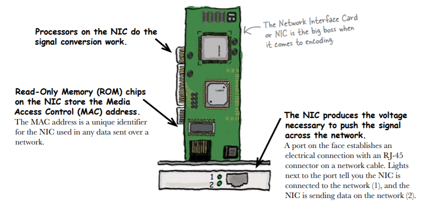
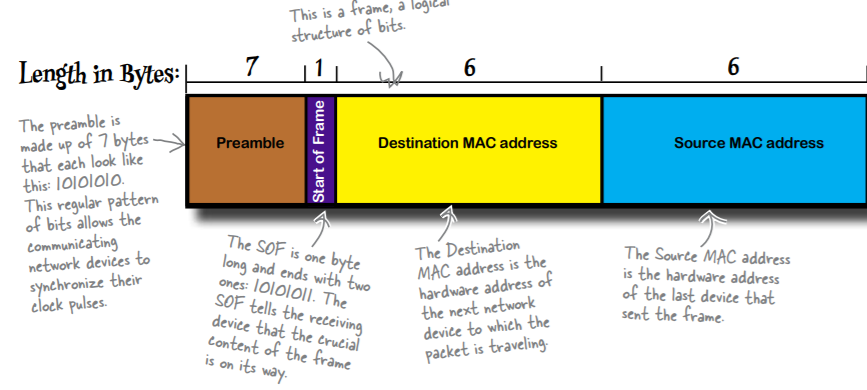
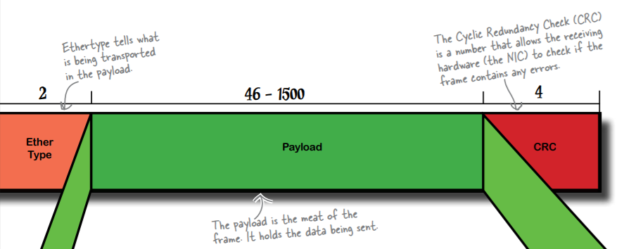
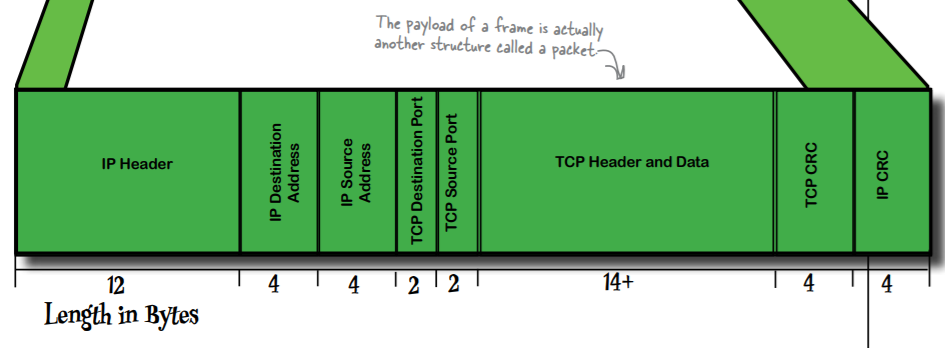
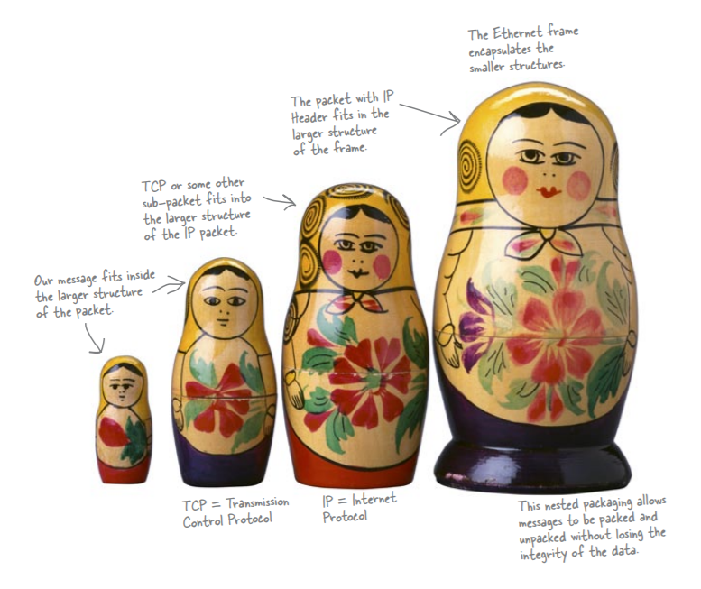

# Data Transfer
 * Network devices send data down the cable by converting the data into a signal. It is broken down into pieces of data known as packets. Data will be encoded before sending and will be decoded at the receiver end.

# Network Interface Card
* Encoding is handled by the Network Interface Card, or NIC, inside
the computer. It handles and decodes digital signals, and is in charge
of all the messaging ins and outs on the computer.

* The NIC starts by taking the message that needs to be sent across
the network. It then turns the message into binary numbers, a
series of 0’s and 1’s. After that, it encodes these numbers, and
sends corresponding voltage signals through an attached network
cable.
* The Ethernet standard tells hardware
how to encode the data,if the signal is sent using the Ethernet protocol,
it uses Manchester encoding. 

# Frames & Packets
* A frame is a logical structure of bits that organizes network traffic so every
device knows how to read the information inside of it. Inside the frame is
another structure called a packet. It’s the real meat of the frame

# Network Frames
* The payload of a frame is actually a structure nested within the frame.
We call it a packet, and the EtherType field lets us know what type of
packet the payload contains. 

## Packet types
* UDP Packet - Protocol Type 17. UDP is used for streaming data such as music and videos.
* ICMP Packet - Protocol Type 1
ICMP is used for testing network connections using the ping program.
* TCP Packet - Protocol Type 6
TCP is used for most IP network communications that require a
reliable connection. By reliable, we mean that no information is lost

