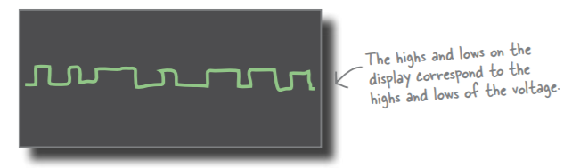
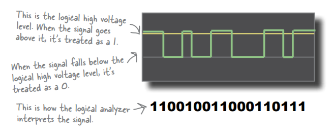

# Toner Tracer
* Listens to electrons. One way of finding a continuity break in a coaxial cable is to listen for
signs of life from the electrons, and we can do this using a toner-tracer set
* A toner and tracer can check for a signal but can’t check for signal quality.

# Multimeter
* Measures voltage,current,resistance and much more

# Oscilloscope
* An oscilloscope is another tool you can use to help you
troubleshoot your network. It shows you the voltage changes on a
wire over time, measured in milliseconds.

# Logical Analyzer
* This is the same oscilloscope we
saw earlier, but it can work as a
logic analyzer as well.
*  Instead of reading the actual voltage,
a logical analyzer reads the signal as a series of binary numbers, or
1’s and 0’s. When the signal goes higher than a set voltage level, the
logical analyzer sees it as 1, and when the signal goes lower, the logical
analyzer sees it as 0. 

# LAN Analyzer
* A LAN analyzer combines the
functions of all the other tools.
* A LAN analyzer essentially acts as a computer on a network. It
fully decodes the signals into actual network data. It takes the
voltages, converts them to 1’s and 0’s, then understands that the
1’s and 0’s represent structured data. This data is in the form of
frames on an Ethernet network.

