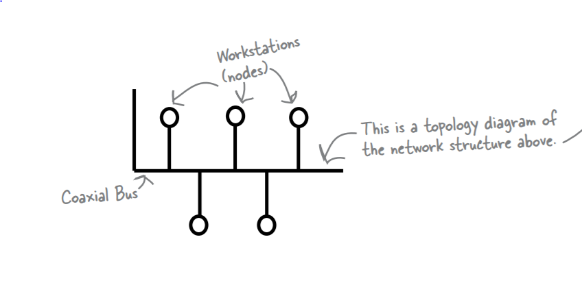
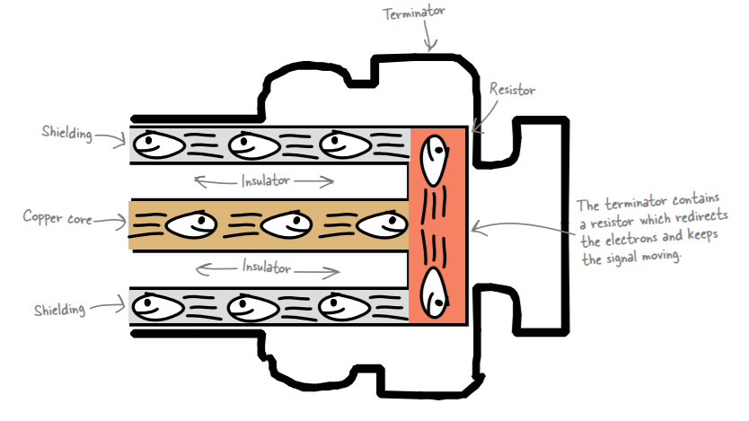
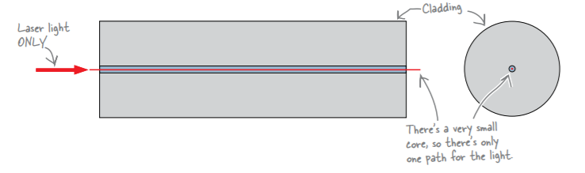
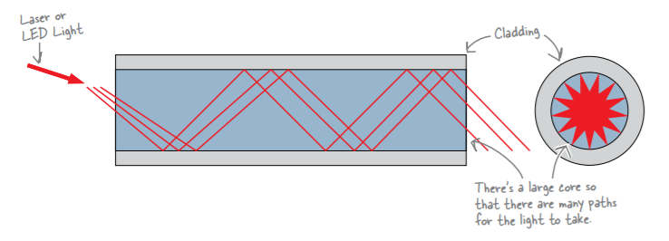
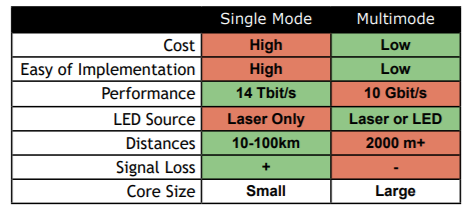

# CAT-5
* Known as Category 5 cable for Ethernet. It has an unshielded twisted pair of cable (UTP cable) and it takes a RJ-45 connector at either ends. 

# Cabling standards
* 568A and 568B are cabling standards that tell you which order your wires
need to go in when fitting an RJ-45 cable.

# Coaxial cable
* Just like CAT-5 cables, coaxial cables are used to create networks. There are
two key differences between them
* The cable contains one big copper wire rather than four
twisted pairs.A coaxial cable has a jacket on the outside, just like a CAT-5 cable. Inside
the cable, however, there’s just the one wire. It has a copper core or
conductor, with a layer of insulation made of plastic and other materials.
* The cables use different sorts of connectors and terminators.
CAT-5 cables use RJ-45 connectors. Coaxial cables, on the other hand, use
BNC connectors, T-connectors, and terminators. The sort of connector you
use depends on why you need it.

* Connectors conduct electrons, so adding connectors to coaxial network
cables helps to maintain continuous electrical flow. Connectors allow
electrons to bridge the gap between cables, or between cables and network
devices, and this allows your network data to get through.
* When the conduction is not looped back through the copper core, we
say that it is not terminated. When a wire isn’t terminated, the network
loses the flow of electrons and, therefore, the flow of network data.
* A terminator ensures that the signal in the cable keeps moving. The
terminator does this by ensuring that the electrons stay in an electrical
loop. A resistor in the terminator redirects electrons to the shielding
layer, which effectively keeps them looping back along the cable without
interfering with the network’s signal. If the main cable is not terminated,
the network will not function.

## Toner-Tracer
*  Listens to electrons. One way of finding a continuity break in a coaxial cable is to listen for
signs of life from the electrons, and we can do this using a
toner-tracer set
* A toner-tracer set is a tool used by network professionals to detect noises
from electrons. You attach the toner part of the toner-tracer set to the
network cable, and the toner then sends a generated signal along the
cable. You then use the tracer to listen for the signal by placing it on the
cable. The tracer sounds when it hears electrons carrying the signal. It
amplifies the signal.
* No sound means no electrons.

# Fiber-Optic Cables
* Fiber-optic cables send network information using light rather than
electrons. Light bounces through the inside of the cable, carrying the
network signal.
* The light passes through the transparent core of the fiber-optic cable.
This core is made of transparent glass or plastic, which allows light to pass
through it easily. The layer just outside of the core is called cladding.
Cladding acts a bit like a mirror, reflecting light so that it bounces along the
core and doesn’t escape.
* The outside of the cable is coated with polymer, and Kevlar® threads
running between the core and the coating add strength and protection to
the cable

## Fusion Splicer
* To fix damaged fiber-optic cables we use Fusion Splicer.
* A fusion splicer allows you to fuse two pieces of fiber together. The
splicer provides high-precision guides that allow you to line up the
fiber. Once you’ve got the ends lined up, you heat the two ends
with an electric arc and push them together. After you fuse the ends
together, the fusion-splicer heat-shrinks a protective cover over your
splice* In a single mode fiber, the light travels in a single path. It takes a laser.

### Single mode fiber
* light, and it has a very small core.

### Multimode fiber
* In a multimode fiber, the light travels many paths. It takes a laser or
LED light, and has a much larger core

* Comparison

