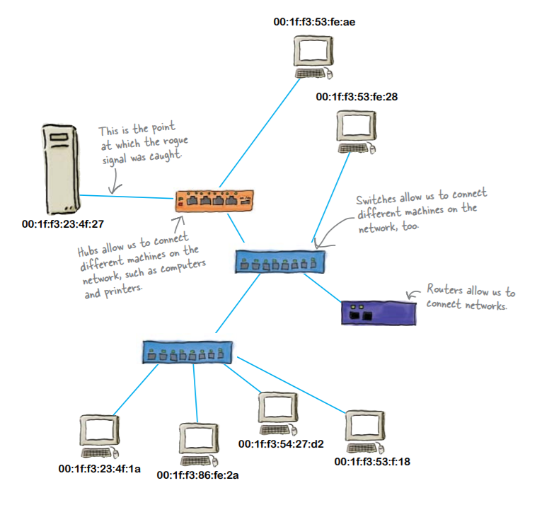
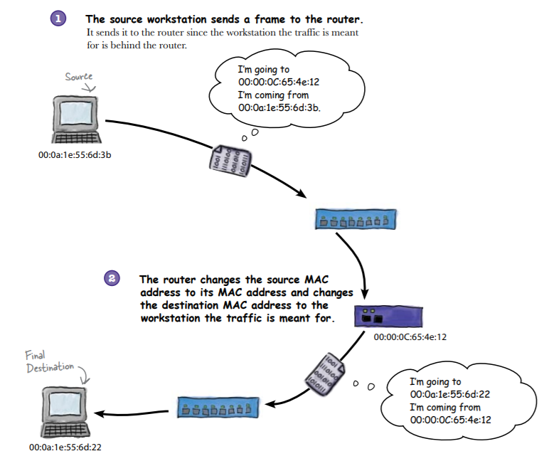

# Networks
* Network isn’t just comprised of computers and servers.
There’s also network devices such as hubs, switches and routers. Hubs and
switches work on the local area network (LAN) or intranet, and routers
allow us to set up wide area networks (WANs) or internets.

## Hubs
* A hub is a dumb device because it doesn’t understand network
data, and it doesn’t know about or store MAC addresses. It
simply repeats incoming signals on all ports, without making
any changes to the signal before broadcasting it.
* Hubs don’t change the MAC address. 
* Hubs contain no processors.
* A hub sends signals, and sends them __everywhere__.
* A hub is really just an
electrical repeater. It
takes whatever signal
comes in, and sends it out
on all the other ports

## Switches
* A switch sends frames, and only sends
them where they need to go
* Switches avoid collisions by storing and forwarding frames on the intranet.
Switches are able to do this by using the MAC address of the frame. Instead
of repeating the signal on all ports, it sends it on to the device that needs it.
* A switch reads the signal
as a frame and uses
the frame’s information
to send it where it’s
supposed to go.
* A switch contains processors, RAM, and ASICS, and this
means that a switch can properly process network data
* Switches store MAC addresses in a lookup table
to keep the frames flowing smoothly

### Switch Working
1.  The source workstation sends a frame.
A frame carries the payload of data and keeps track of the
time sent, as well as the MAC address of the source and the
MAC address of the target.
2. The switch updates its MAC address table with
the MAC address and the port it’s on.
Switches maintain MAC address tables. As frames come
in, the switch’s knowledge of the traffic gets more descript.
The switch matches ports with MAC addresses.
3. The switch then forwards the frame to its target
MAC address using information from its table.
It does this by sending the frame out the port where
that MAC address is located as the MAC address table
indicates. 

#### Wireshark 
*  Software to monitor packets

## Routers
* Routers have MAC addresses too.
* If network traffic comes from a router, we can only see the
router’s MAC address. All the workstations behind that router
make up what we call an IP subnet. All a switch needs to look at
to get frames to their destination is the MAC address. A router
looks at the IP address from the incoming packet and forwards it
if it is intended for a workstation located on the other network.

*  Routers specialize in seamlessly moving network
traffic from one network to another.
